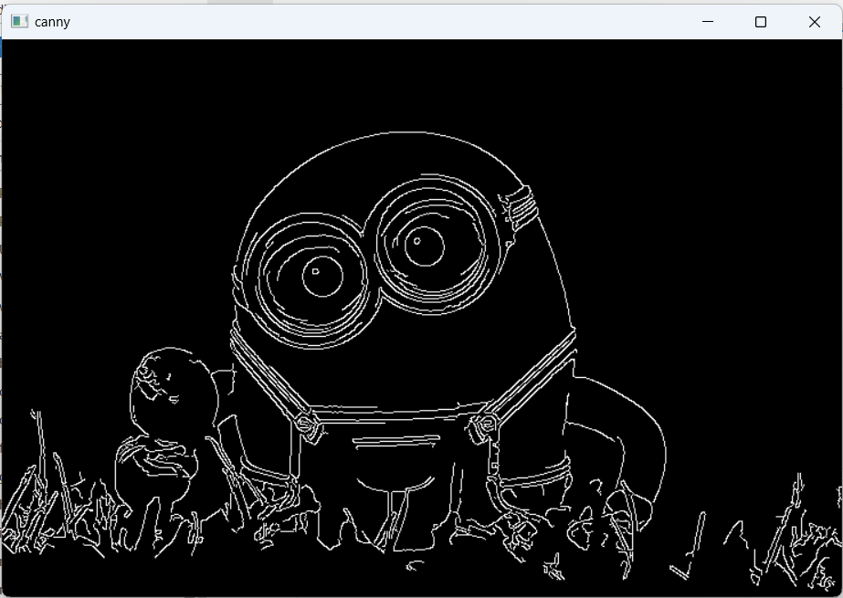

# Edge-Linking-using-Hough-Transformm
## Aim:
To write a Python program to detect the lines using Hough Transform.

## Software Required:
Anaconda - Python 3.7

## Algorithm:
### Step1:

Import all the necessary modules for the program.
### Step2:

Load a image using imread() from cv2 module.
### Step3:

Convert the image to grayscale.
### Step4:

Using Canny operator from cv2,detect the edges of the image.
### Step5:

Using the HoughLinesP(),detect line co-ordinates for every points in the images.Using For loop,draw the lines on the found co-ordinates.Display the image.
### Program :
#### Read the original image :
```
import cv2
import numpy as np
r=cv2.imread('min1.png',1)
cv2.imshow('origianl',r)
cv2.waitKey(0)
cv2.destroyAllWindows()
```
##### Convert the image to grayscale :
```

gray=cv2.cvtColor(r,cv2.COLOR_BGR2GRAY)
cv2.imshow('gray',gray)
cv2.waitKey(0)
cv2.destroyAllWindows()
```
#### Apply Gaussian Blur :
```
img = cv2.GaussianBlur(gray,(3,3),0)
cv2.imshow('Blur',img)
cv2.waitKey(0)
cv2.destroyAllWindows()
```
#### Apply Canny :
```
canny_edges = cv2.Canny(img, 50, 120)
cv2.imshow('canny',canny_edges)
cv2.waitKey(0)
cv2.destroyAllWindows()
```
#### Detect points that form a line using HoughLinesP :
```
lines =cv2.HoughLinesP(canny_edges, 1, np.pi/180,threshold = 15, minLineLength =5 ,maxLineGap = 7)
```

#### Draw lines on the image : 
```
for line in lines:
 x1,y1,x2,y2 = line[0]
 cv2.line(r, (x1,y1),(x2,y2),(255,0,0),3)
```
#### Display the Hough Detected Image :
```
cv2.imshow('hough_detected',r)
cv2.waitKey(0)
cv2.destroyAllWindows()

```
## Output

### Input image and grayscale image


### Canny Edge detector output


### Display the result of Hough transform

